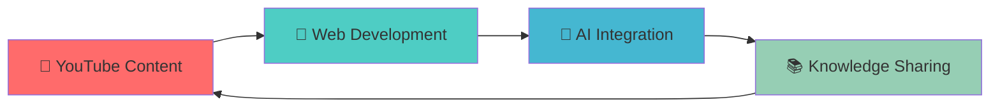

# <div align="center">👋 Hi there, I'm **Samir Rain**</div>

<div align="center">  </div> <div align="center"> <a href="https://www.youtube.com/channel/CodeWithSamir">  </a > here is all text not visibel bcausee of second code put second code more down   </div>


---

## 🚀 About Me

> **Passionate Software Developer** specializing in modern web development with a mission to make coding accessible through education.

```typescript
const samir: Developer = {
  location: "Nepal 🇳🇵",
  expertise: ["React.js", "Next.js", "Node.js", "Tailwind CSS"],
  passion: "Building practical, real-world projects",
  mission: "Teaching coding & sharing knowledge",
  currentStatus: "Creating innovative solutions",
  motto: "Code. Teach. Inspire. Repeat."
};
```

**🎯 What Drives Me:**
- 💡 Transforming ideas into functional web applications
- 📚 Making complex concepts simple through tutorials
- 🌱 Continuously learning and sharing knowledge
- 🤝 Building technology that makes a difference

---

## 🎬 YouTube Channel: **CodeWithSamir**

<div align="center">
  <a href="https://www.youtube.com/channel/CodeWithSamir">
    
  </a>
</div>

### 📹 Content I Create:
```
🌐 Web Development        ████████████████████ 100%
⚛️  React.js Tutorials     ████████████████████ 100%
🔥 Next.js Projects       ████████████████████ 100%
🎨 Tailwind CSS Guides    ████████████████████ 100%
💡 Coding Tips & Tricks   ████████████████████ 100%
```

**📺 Subscribe for:**
- Step-by-step **React.js** and **Next.js** tutorials
- Practical projects for beginners and advanced learners
- **Tailwind CSS** design techniques
- Real-world development tips and best practices

<div align="center">
  <a href="https://www.youtube.com/channel/CodeWithSamir?sub_confirmation=1">
    
  </a>
</div>

---

## 🛠️ Technical Expertise

<div align="center">

### 🎨 Frontend Development


### ⚡ Backend & Languages


### 🗄️ Database & State Management


### 🌐 Frameworks & Tools


</div>

---

## 📊 GitHub Statistics

<div align="center">
  
  
</div>

<div align="center">
  
</div>

---

## 🏆 Achievements & Highlights

<div align="center">
  
</div>

### 🎯 What I Specialize In:
- **🌐 E-commerce Development** - Building complete online stores
- **⚛️ React Applications** - Modern, responsive web apps
- **🎨 UI/UX Design** - Beautiful interfaces with Tailwind CSS
- **📹 Code Education** - Teaching through YouTube tutorials
- **👥 Team Leadership** - Project management and collaboration

---

## 🌟 Current Focus

<div align="center">
  

```mermaid
graph LR
    A[🎥 YouTube Content] --> B[📱 Web Development]
    B --> C[🤖 AI Integration]
    C --> D[📚 Knowledge Sharing]
    D --> A
    
    style A fill:#FF6B6B
    style B fill:#4ECDC4
    style C fill:#45B7D1
    style D fill:#96CEB4
```

</div>

- 🔥 **Creating engaging coding tutorials** for YouTube
- 🚀 **Building modern web applications** with React ecosystem
- 🤖 **Exploring AI integration** in web development
- 📖 **Sharing practical coding knowledge** with the community

---

## 📬 Let's Connect

<div align="center">

[](https://samirrain.com.np/)
[](https://www.youtube.com/channel/CodeWithSamir)
[](https://np.linkedin.com/in/samir-rain-0467b7259?trk=people-guest_people_search-card)
[](mailto:codewithsamir@gmail.com)

</div>

---

## 💡 Fun Developer Stats

<div align="center">

| 🏷️ **Metric** | 📊 **Value** |
|:---|:---:|
| ⭐ **Favorite Language** | JavaScript |
| 🚀 **Go-to Framework** | React.js |
| 🎨 **Styling Choice** | Tailwind CSS |
| ☕ **Coffee Consumed** | ∞ cups |
| 🐛 **Bugs Fixed** | Too many to count |
| 💡 **Ideas Generated** | Daily |

</div>

---

<div align="center">
  
</div>

<div align="center">
  
### 🚀 **"Building the web, one component at a time"**

⭐ **Star my repositories** if you find them helpful! ⭐

</div>
